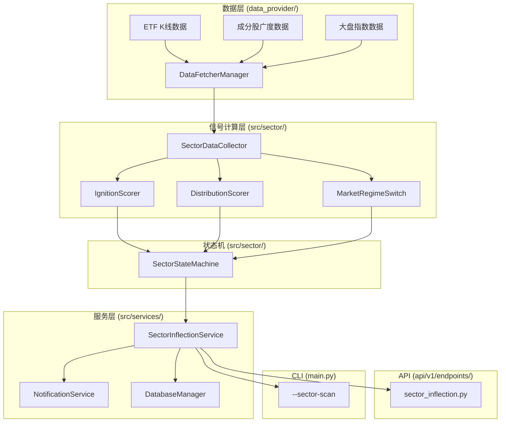

# ETF 板块拐点捕捉策略 — 集成实施计划

## 目标

将 **A股 ETF 板块拐点捕捉策略** 作为一个独立子系统集成到 `daily_stock_analysis`，提供板块级别的「启动评分 IgnitionScore」「见顶评分 DistributionScore」和五状态机决策，同时复用现有数据层、通知层、存储层和 Web/API 基础设施。

---

## User Review Required

> [!IMPORTANT]
> 以下设计决策需要你确认后才开始编码：

1. **板块范围**：建议初始以 **15-20 个流动性好的行业 ETF** 为种子池（半导体、医药、消费、新能源、证券、军工、银行等），而非全部 31 个申万一级。后续可在 WebUI 中增删。你同意这个初始范围吗？
2. **扫描频率**：建议 **日频扫描（收盘后）+ 信号触发才调仓**，与现有 `--schedule` 定时任务同步运行。而非独立的高频扫描。
3. **灵敏度**：建议偏 **"确认"侧**（晚一点上车、信号准交易少），与产品文档一致。
4. **聪明钱仓位数据（SMP）**：当前阶段我们暂无公募基金的实时或每日持仓数据接口（通常季度披露有滞后）。计划先上线「量价骨架」，SMP 模块预留接口但不实现实际计算（返回 0/None）。后续你提供更及时的数据源后再接入。这个理解正确吗？
5. **与现有个股分析的关系**：板块拐点系统是 **独立于** 个股分析流水线的并行子系统。两者共享 `DataFetcherManager`、`NotificationService`、`DatabaseManager`，但各自独立运行。板块信号可以作为个股分析的「背景上下文」注入（类似现有的 `DailyMarketContext`），但不会修改个股分析的核心流程。

---

## Open Questions

> [!IMPORTANT]
> 1. **避险 ETF 池**：产品文档提到"10年国债 ETF、短融 ETF、货币 ETF、黄金 ETF"作为风险 OFF 时的停泊标的。是否需要在系统中跟踪这些标的的行情？还是仅作为人工参考？
> 2. **数据源选择**：板块 ETF 的日 K 线 and 成分股数据，是否使用现有的 AkShare（免费、数据质量尚可）？还是需要接入 Tushare Pro / Wind 等付费数据源？
> 3. **大盘总开关基准**：建议使用 **沪深 300 指数**（000300）作为大盘趋势开关的基准，因为 AkShare 可以直接获取，无需 Wind 授权。
> 4. **回测评估**：板块策略的回测是否需要完整的回测框架？还是先使用类似现有 `BacktestEngine` 的简单信号评估？

---

## Proposed Changes

整体架构按照现有项目的分层规范：数据层 → 信号计算层 → 状态机 → 服务层 → API → WebUI。



---

### Phase 1：数据层 + 核心信号计算（量价骨架）

#### [NEW] [sector_data.py](file:///D:/tools/stock-analysis/daily_stock_analysis/src/sector/sector_data.py)

板块数据采集器，职责：
- 管理 ETF 池（从配置 + DB 读取）
- 通过 `DataFetcherManager` 获取 ETF 日 K 线（60-120 交易日）
- 获取成分股级别的广度数据（上涨家数、站上 MA20 家数等）
- 获取大盘基准指数（沪深 300）的 K 线用于 RS 相对强度计算
- 计算技术指标：MA、MACD、RSI、成交量均值、乖离率、箱体边界

```python
@dataclass
class SectorSnapshot:
    """单个板块的完整数据快照"""
    etf_code: str                    # ETF 代码
    sector_name: str                 # 板块名称
    trade_date: date                 # 交易日
    # K线数据
    close: float
    ma5: float; ma10: float; ma20: float; ma60: float; ma200: float
    volume: float; volume_ma60: float
    # 技术指标
    macd_dif: float; macd_dea: float; macd_bar: float
    rsi_14: float
    bias_ma5: float; bias_ma20: float
    # 相对强度
    rs_vs_benchmark: float           # 板块/沪深300 相对强度线
    rs_trend: str                    # "rising" / "falling" / "flat"
    # 广度
    breadth_up_pct: float            # 成分股上涨占比
    breadth_above_ma20_pct: float    # 成分股站上 MA20 占比
    breadth_new_high_pct: float      # 成分股创 20 日新高占比
    # 箱体
    box_high: float                  # 60 日箱体上沿
    box_low: float                   # 60 日箱体下沿
    is_near_box_low: bool            # 是否接近箱体下沿
    # 聪明钱（Phase 3 接入）
    smp_delta: Optional[float]       # ΔSMP，聪明钱仓位变化
```

---

#### [NEW] [ignition_scorer.py](file:///D:/tools/stock-analysis/daily_stock_analysis/src/sector/ignition_scorer.py)

启动评分器（0-100），基于产品文档的六个维度：
- 聪明钱先行 (SMP, 25%)
- 底部结构 (箱体低位, 20%)
- 放量突破 (量>60日均量×1.5, 25%)
- 相对强度反转 (RS 线拐头, 15%)
- 广度改善 (上涨家数占比上升, 10%)
- 催化事件 (新闻/事件, 5%)

---

#### [NEW] [distribution_scorer.py](file:///D:/tools/stock-analysis/daily_stock_analysis/src/sector/distribution_scorer.py)

见顶评分器（0-100），基于产品文档的六个维度：
- 聪明钱撤离 (25%)
- 顶背离 (MACD/RSI 背离, 25%)
- 量能背离/滞涨 (20%)
- 广度恶化 (15%)
- 估值/拥挤极端 (5%)
- 破位 (跌破 MA20/MA60, 10%)

---

#### [NEW] [market_regime.py](file:///D:/tools/stock-analysis/daily_stock_analysis/src/sector/market_regime.py)

大盘总开关，最高优先级的一票否决机制：
- 基准: 沪深 300 (000300)
- 风险 ON : 指数 > 200日均线 → 允许执行启动信号
- 风险 OFF: 指数 < 200日均线 → 禁止新买入，持仓全清

---

### Phase 2：状态机 + 持久化

#### [NEW] [state_machine.py](file:///D:/tools/stock-analysis/daily_stock_analysis/src/sector/state_machine.py)

五状态机实现，管理每个板块的生命周期：
- `SCANNING` (空仓扫描)
- `LURKING` (潜伏观察)
- `HOLDING` (持有)
- `ALERT` (警戒持有)
- `EXITED` (离场，短暂中间态)

状态转移规则严格遵循产品文档中定义的转换条件。

---

#### [NEW] 数据库表 `sector_inflection_state` 和 `sector_etf_pool`

在 [storage.py](file:///D:/tools/stock-analysis/daily_stock_analysis/src/storage.py) 中新增 ORM 模型：
- `SectorETFPool`：存储可配置的板块 ETF 标的池。
- `SectorInflectionState`：记录每日扫描的评分、状态机状态和转移原因。

---

### Phase 3：服务层 + CLI + 通知

#### [NEW] [sector_inflection_service.py](file:///D:/tools/stock-analysis/daily_stock_analysis/src/services/sector_inflection_service.py)

核心业务服务，编排整个扫描流程：
1. 加载活跃 ETF 池
2. 批量获取板块及成分股广度数据
3. 评估大盘总开关状态
4. 计算每个板块的 IgnitionScore + DistributionScore
5. 驱动状态机转移并持久化
6. 推送每日状态变更报告

#### [MODIFY] [main.py](file:///D:/tools/stock-analysis/daily_stock_analysis/main.py)

新增命令行参数：
- `--sector-scan`：在每日分析流中加入板块拐点扫描。
- `--sector-scan-only`：仅运行板块拐点扫描，不执行个股分析。

#### [MODIFY] [notification.py](file:///D:/tools/stock-analysis/daily_stock_analysis/src/notification.py)

新增板块拐点报告的格式化和发送逻辑（支持企业微信、飞书、邮件等）。

---

### Phase 4：API + WebUI

#### [NEW] [sector_inflection.py](file:///D:/tools/stock-analysis/daily_stock_analysis/api/v1/endpoints/sector_inflection.py)

FastAPI 路由：
- `GET /api/v1/sector/dashboard`：获取板块最新状态和评分。
- `GET /api/v1/sector/{etf_code}/history`：获取单板块历史状态序列。
- `POST /api/v1/sector/scan`：手动触发扫描。
- `GET/POST/DELETE /api/v1/sector/pool`：管理 ETF 池。

#### WebUI 集成

在前端（Vue 3 + TS）新增 **板块拐点** 页面，包含大盘风险开关状态、板块状态卡片、评分图表及 ETF 池管理配置页。

---

### Phase 5：聪明钱（SMP）+ 新闻催化（预留接口）

#### [NEW] [smp_calculator.py](file:///D:/tools/stock-analysis/daily_stock_analysis/src/sector/smp_calculator.py)

聪明钱计算接口，当前返回 0 或 None，预留给后续的基金季度/定期仓位数据源。

#### [NEW] [news_catalyst.py](file:///D:/tools/stock-analysis/daily_stock_analysis/src/sector/news_catalyst.py)

结合现有 `SearchService` 与大模型，对板块政策或行业重大新闻进行正面/负面评分。

---

## Verification Plan

### Automated Tests

```bash
# 1. 运行板块单元测试（评分器、状态机、大盘开关）
python -m pytest tests/test_sector/ -v

# 2. 运行完整扫描集成测试
python -m pytest tests/test_sector/test_sector_integration.py -v
```

### Manual Verification

- [ ] 运行 `python main.py --sector-scan-only` 验证在不触发个股分析下能成功生成板块拐点报告。
- [ ] 验证大盘处于 MA200 以下时，所有板块均被强行转换为 `EXITED` 状态。
- [ ] 验证 Web 接口返回的数据在前端页面能正常渲染。
- [ ] 验证状态变化能够正常触发通知推送（如飞书/企业微信/邮件）。
